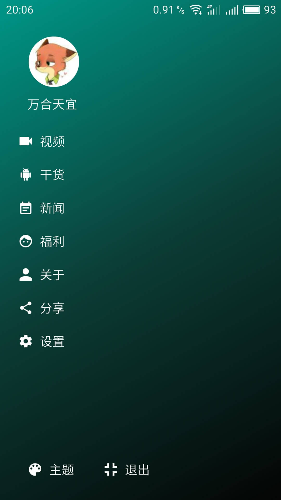

# GankIT
> 个人开源项目，基于 MVP + Retrofit + RxJava 进行架构，主要包括视频，干货，新闻，福利这四个大模块。
>
> 个人博客：http://www.jianshu.com/users/64f479a1cef7/latest_articles

## APK下载
* [fir.im下载](http://fir.im/gankit)
* 扫码下载

## 项目预览

## 项目简介
* 基于 MVP + Retrofit + RxJava进行架构
* 使用Lambda表达式精简代码
* 使用ResideMenu3D侧滑菜单
* 使用大量绚丽的Material Design控件
* 使用MultipleTheme实现无缝切换主题（在MVP架构中使用比较困难，层级太多）
* 使用IconFont处理项目中大部分小图标
* 封装Glide框架加载图片
* 使用Gson解析json数据生成实体bean
* 使用EventBus实现组件之间的通信
* 使用ButterKnife绑定id
* 使用EasyRecyclerView处理数据的展示
* 使用SwipeBackLayout实现滑动返回销毁Activity
* 使用节操播放器实现视频播放
* 使用CardStack实现发现页面的绚丽卡片栈
* 使用CircleImageView显示圆形头像
* 使用NineGridView显示新闻里的图片
* 使用PhotoView实现福利图片的缩放
* 使用Fiddler抓包咪咕影院数据，干货和福利数据来自与gank.io，新闻数据来自于易源（仅用于学习）
* 使用LeakCanary检测内存泄漏，并未发现内存泄漏
* 使用Lint工具检测工程中没有用到的资源文件,设置打包忽略

## 功能架构
* 视频
	* 精选
	* 专题
	* 发现
	* 我的
* 干货
* 新闻
* 福利

## 遇到的难题
* 在侧滑菜单中切换主题后，Fragment中的控件不能切换主题。底部导航栏不能切换主题。
> 问题描述：在MainActivity中切换主题后，在Fragment中并没有切换主题的代码，
  所以需要将修改主题的代码放置在BaseFragment中，然后在MainActivity发送切换主题的消息，BaseFragment订阅到事件后就切换主题。
  但是移植代码后，又发现底部导航栏不能切换，因为切换时执行不到底部导航位置。
>
> 底部导航栏切换主题待解决。

* SwipeDeck和ResideMenu的滑动冲突问题
> 问题描述：SwipeDeck左右切换时会直接作用到ResideMenu上
>
> 解决：将SwipeDeck直接添加到ResideMenu上忽略清单中，就可以让SwipeDeck自己处理内部事件。
ResideMenu会在dispatchTouchEvent方法里对忽略清单里的View进行事件处理。

* ViewPager和SwipeBackLayout的滑动冲突问题
> 问题描述：在可以又滑返回销毁的Activity中ViewPager是没有滑动事件的。
>
> 解决：自定义ViewPager，重写dispatchTouchEvent方法，判断左滑时请求不要拦截事件。

* 集成PhotoView控件后，图片显示在左上角，不能居中。
> 解决：在布局文件中直接使用PhotoView，不用ImageView就好了。

* 集成NineGridView不显示图片问题
> 解决：在App中自定义图片加载器，NineGridView默认使用Picasso加载图片，而这个项目使用的是Glide,所以不会加载

* 若干小问题

## TODO
* 制作开发UML类图
* 开发视频模块搜索功能
* 解决切换主题不能立刻切换主页底部导航栏问题
* 将QQ登陆操作移植到Presenter层进行
* 重构干货和新闻页面，根据构造传入的View来返回加载的数据参数
* 完善我的和设置模块内容

## 项目用到的第三方开源类库（膜拜大神）
* [ButterKnife注解获取控件id](https://github.com/JakeWharton/butterknife)

        compile 'com.jakewharton:butterknife:8.4.0'
        apt 'com.jakewharton:butterknife-compiler:8.4.0'

* [3D侧滑菜单](https://github.com/SpecialCyCi/AndroidResideMenu)

        compile 'com.specyci:residemenu:1.6+'

* [圆形头像](https://github.com/hdodenhof/CircleImageView)

        compile 'de.hdodenhof:circleimageview:2.1.0'

* [Android-Iconics（图标库）](https://github.com/mikepenz/Android-Iconics)

        compile 'com.mikepenz:iconics-core:2.5.5@aar'
        compile 'com.mikepenz:material-design-iconic-typeface:2.2.0.1@aar'
        compile 'com.mikepenz:fontawesome-typeface:4.5.0.1@aar'
        compile 'com.mikepenz:foundation-icons-typeface:3.0.0.1@aar'

* [Fragmentation优化官方的Fragment库，功能特别强大](https://github.com/YoKeyword/Fragmentation)

        compile 'me.yokeyword:fragmentation:0.7.12'
        compile 'me.yokeyword:fragmentation-swipeback:0.7.9'

* [EventBus实现组件间通信](https://github.com/greenrobot/EventBus)

        compile 'org.simple:androideventbus:1.0.5.1'

* [RxJava](https://github.com/ReactiveX/RxJava)与[Retrofit](https://github.com/square/retrofit)

        compile 'io.reactivex:rxandroid:1.2.1'
        compile 'io.reactivex:rxjava:1.1.6'
        compile 'com.squareup.retrofit2:retrofit:2.1.0'
        compile 'com.squareup.retrofit2:converter-gson:2.1.0'
        compile 'com.squareup.retrofit2:adapter-rxjava:2.1.0'

* [Gson解析json数据](https://github.com/google/gson)

        compile 'com.google.code.gson:gson:2.4'

* [material design对话框](https://github.com/afollestad/material-dialogs)

        compile 'com.afollestad.material-dialogs:core:0.9.0.2'
        compile 'com.afollestad.material-dialogs:commons:0.9.0.2'

* [自动化测试库，功能强大](https://github.com/JakeWharton/double-espresso)

        compile 'com.android.support.test.espresso:espresso-core:2.2.2'

* [封装好的RecyclerView](https://github.com/Jude95/EasyRecyclerView)

        compile 'com.jude:easyrecyclerview:4.0.6'

* [Glide加载图片](https://github.com/bumptech/glide)

        compile 'com.github.bumptech.glide:glide:3.7.0'

* [卡片任务栈布局](https://github.com/xmuSistone/android-card-slide-panel)

        compile 'com.daprlabs.aaron:cardstack:0.3.1-beta0'

* [节操播放器](https://github.com/lipangit/JieCaoVideoPlayer)

        compile 'fm.jiecao:jiecaovideoplayer:4.7.1_preview'

* [九宫格图片显示](https://github.com/jeasonlzy/NineGridView)

         compile 'com.lzy.widget:ninegridview:0.2.1'

* [LeakCanary内存泄漏](https://github.com/square/leakcanary)

        debugCompile 'com.squareup.leakcanary:leakcanary-android:1.3'
        releaseCompile 'com.squareup.leakcanary:leakcanary-android-no-op:1.3'

## 开发日志
###  2016.10.20
* 对项目进行功能架构，大体分为三大模块
* 对模块进行细分，完成了功能架构
* 研究MVP模式实际项目中使用
* 研究RxJava+retrofit实际项目中使用
* 对咪咕影院进行抓包，整合视频API

###  2016.10.21
* 研究Gank开源项目
* 研究OkGo封装代码
* 研究RxJava+Retrofit使用
* 研究MVP使用

###  2016.10.22
* 初始化项目
* 将项目上传至GitHub，将项目上传至Coding
* 抽取APP,BaseActivity,BaseFragment等常见基类
* 整理常用工具类
* 集成ResideMenu框架，测试ResideMenu功能

### 2016.10.23

### 2016.11.10
* 更新版本
* 搭建干货界面UI框架
* 建立FragmentFactory工厂类生产API对应的Fragment
* 解决ViewPager与SwipeBackLayout的滑动冲突
* 完成干货界面的UI框架搭建
* 研究webp替换png格式文件进行apk瘦身
* 使用iSparta工具将项目png图片转换成wep图片
* 图片模糊，重构整个项目，重新提交GitHub

### 2016.11.11
* 对功能重新架构，将干货模块的福利功能分离成一个大功能模块
* 搭建干货界面model层，封装API
* 由于干货界面和新闻显示都是ToolBar+TabLayout+ViewPager，所以将其抽取成基类
* 由于干货界面每个Fragment的样子都一样，条目都一样，所以将加载数据和显示的适配器抽取成基类
* 复用基类完成了所有干货页面的基本显示
* 完成干货界面的完整显示功能，实现了点击链接跳转

### 2016.11.12
* 研究Lambda表达式在android中的使用情况
* 使用Lambda表达式对大部分代码进行了重构，简化了代码逻辑
* 封装福利页面的API接口
* 加载福利页面的数据，使用RecyclerView的瀑布流布局和CardView条目展示
* 福利页面条目点击进入图片阅览
* 添加保存本地和分享功能
* 对代码进行了优化

### 2016.11.13
* 重构干货基类的适配器，完善了上拉刷新和下拉加载
* 对干货界面的Fab进行了抽取，使用EventBus完善了干货界面Fab的跳转
* 优化了阅图界面功能，实现了本地保存和分享图片
* 集成PhotoView实现图片的缩放和长按保存功能
* 对项目整体的UI图标进行了重构优化

### 2016.11.14
* 复用基类完成了新闻Fragment的界面初始化
* 封装新闻数据的API接口
* 由于新闻每个Fragment和显示的条目都是一样的，所以将加载数据和显示的适配器抽取成基类
* 集成NineGridView显示条目的条目，类似于微信朋友圈说说效果，点击还能阅览
* 复用基类，完成了新闻页面的基本显示
* 完成点击条目跳转到WebActivity
* WebActivity根据Intent带过来的标题和Url进行显示

### 2016.11.15
* 检查项目遗留的小问题
* 使用LeakCanary检查内存泄漏，未发现泄漏
* 使用Link工具检查项目未使用的静态资源，打包忽略
* 签名打包，提交fir.im

## 开源协议
	Copyright 2016 PingerWan.

	Licensed under the Apache License, Version 2.0 (the "License");
	you may not use this file except in compliance with the License.
	You may obtain a copy of the License at

	   http://www.apache.org/licenses/LICENSE-2.0

	Unless required by applicable law or agreed to in writing, software
	distributed under the License is distributed on an "AS IS" BASIS,
	WITHOUT WARRANTIES OR CONDITIONS OF ANY KIND, either express or implied.
	See the License for the specific language governing permissions and
	limitations under the License.